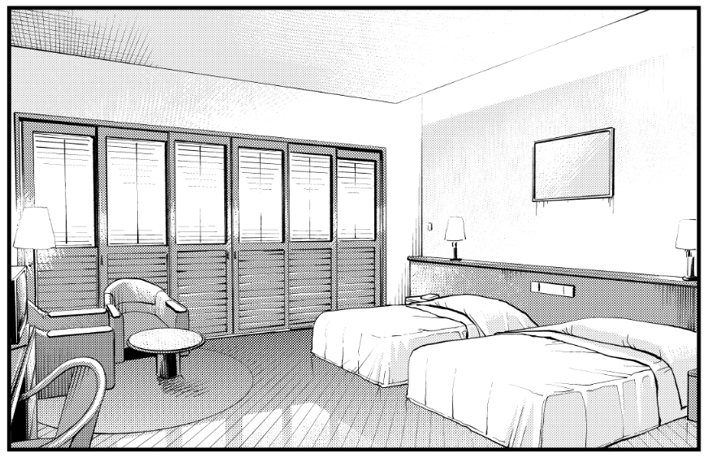

写真の模写

使用ソフト:CLIP STUDIO PAINT EX

下書き:1時間

線画:4時間

## 2022年6月19日追記

描き直ししてトーンを貼ってみました。

トーンは10%と30%とグラデーションの三種です。特別な指示が無い限り1枚の背景にトーンはあまり多用しません。

4~5時間ぐらいです。

## 出典
[pro.foto](https://pro-foto.jp/free/product_info.php/cPath/21_27_64/products_id/416)
