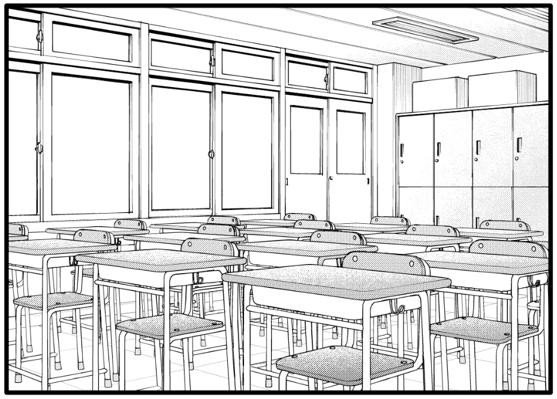

描き起こし

使用ソフト:CLIP STUDIO PAINT EX

下書き:1時間

線画:3時間

トーン:30分

## 2022年5月5日追記

机の3D素材を使用して描き直ししてみました。LT変換でベクターレイヤーに出力し、線幅を変えています。

フレネル反射を意識して側面(このアングルの場合机と椅子の上面)に削りを入れるとそれらしくなります。

### 使用素材
[CLIP STUDIO ASSETS](https://assets.clip-studio.com/ja-jp/detail?id=1859616)
