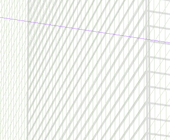

写真を参考に描き起こししています。
今回はCLIPに出品のため丁寧な線画を意識しました。
(通常、アナログで描くことをイメージし、また効率のため表示倍率を下げて作画しています。)

使用ソフト:CLIP STUDIO PAINT EX

所要時間:7時間程度

[CLIP STUDIO ASSETS](https://assets.clip-studio.com/ja-jp/detail?id=1906270)

## 補足
効率のため、ビルの窓など構造を描くのに、補助線を引くのではなく、2通りのやり方を採用しています。

1. 正面図を作成し、パースに合わせ変形
2. パース定規のグリッド機能の使用

5分割程度であれば補助線を引いてしまったほうが早いですが、等間隔に細かく線を引きたい場合はこのほうが便利です。

